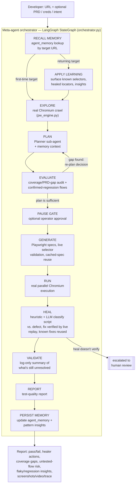

# QAlchemist — Autonomous Test Orchestration Agent

*Turn a URL into proven, self-healing tests. Built by team **Alchemists** for the Bessemer Tech
Catalyst — an agent that transmutes an untested app into a working test suite and a quality report,
end to end, with no manual scripting in between.*

Paste a target web-app URL (+ optional login creds, PRD, or natural-language intent) and an autonomous
meta-agent explores it with a real headless browser, plans meaningful test flows, audits coverage gaps,
generates Playwright specs with live selector validation, runs them for real, self-heals broken scripts
(verified by replaying the fix in a live browser, not assumed) vs. classifies genuine app defects —
streaming every decision live and producing an exportable test-quality report. Run it again against a
target it's already seen, and it remembers: known-good selectors, previously healed locators, and
recurring defects that graduate into confirmed regressions.

**Pipeline (LangGraph `StateGraph`):**
`RECALL MEMORY → [EXPLORE|APPLY LEARNING→EXPLORE] → PLAN → EVALUATE → PAUSE GATE → GENERATE → RUN → HEAL → VALIDATE → REPORT → PERSIST MEMORY`

The meta-agent is not a fixed one-pass pipeline — it's a compiled LangGraph `StateGraph`, and branching
is expressed as real, typed graph edges rather than inline `if`s:

- **Learning gate** — `RECALL MEMORY` looks up this target's history by URL; a *returning* target routes
  through `APPLY LEARNING` (surfacing what was learned before EXPLORE even runs), a first-time target
  skips straight to `EXPLORE`.
- **Re-plan loop** — if the Evaluator finds a high-severity coverage gap or an unmet PRD requirement, the
  graph escalates back to the Planner with that feedback for one re-planning pass before generation
  proceeds. Capped at one cycle (tracked in graph state via `replanned`), so a genuinely incomplete plan
  can't loop the pipeline forever.

HEAL itself already includes its own heal-and-verify step — a proposed fix is live-replayed immediately,
and only reported as `healed` if that replay actually passes. `VALIDATE`, after HEAL, doesn't retry: it's
a log-only summary of whatever's left unresolved (a heal that didn't verify, or a genuine app defect).
Those go to REPORT as `review`/`defect` and become a human call from there — Flag as Defect or Dismiss in
the Healer tab — rather than another automatic PLAN/GENERATE/RUN cycle.

**Stack:** React + Tailwind + shadcn/ui · FastAPI (async) · LangGraph · MongoDB · Playwright (Chromium) · Sarvam AI (sarvam-105b)

---

## Architecture



Every stage streams its decisions live over SSE to the frontend's Decision Stream. When the LLM
(Sarvam AI) is unavailable or rate-limited, each stage has a deterministic fallback derived from the
real discovered surface (not a fixed generic template) so the pipeline never silently stalls or produces
misleading output — see `_fallback_flows` / `_fallback_evaluation` in `orchestrator.py`.

The `EVALUATE → PLAN` re-plan edge is one-shot: it's gated by a `replanned` flag carried in the graph's
typed state that the router checks before allowing another loop, so a second audit always falls through
to the pause gate instead of looping again.

---

## Memory & cross-run learning

Every run's target URL is normalized (host + path) into an `agent_memory` key in MongoDB — recalled by
the `RECALL MEMORY` node before EXPLORE, and updated by `PERSIST MEMORY` after REPORT. Run the same
target again and the pipeline behaves differently because of what it remembers:

| Remembered | Used by | Effect on the next run |
|---|---|---|
| Known-good selectors (validated across runs) | GENERATE | seeded into the LLM prompt + the selector-validation pool, so proven locators are reused instead of reinvented |
| Healed locator map (`old selector → new selector`) | HEAL | a previously-fixed selector is reapplied directly — no LLM classification needed for that failure |
| Recurring defect signatures (`flow name :: fail type`) | PLAN, EVALUATE, HEAL | ≥2 occurrences becomes a **confirmed regression**: EVALUATE force-adds a dedicated regression-check flow, and HEAL auto-classifies a repeat as a defect (skipping the LLM call) with escalated severity |
| Coverage-gap areas | PLAN | prompted to prioritize flows for known trouble spots |
| Cached, fully-verified specs (keyed by flow name + a hash of its steps) | GENERATE | an unchanged flow with stable selectors is reused verbatim, skipping a fresh LLM call entirely |
| Per-flow pass/heal history | PERSIST MEMORY | drives **flaky-flow** detection (alternates pass/fail across runs) and **chronic-selector-instability** detection (healed ≥2 times) — surfaced as `pattern_insight` events and on the report |

This is the literal "if the URL comes again, pick up the learning" behavior: `RECALL MEMORY`'s
conditional edge routes a target with `run_count > 0` through `APPLY LEARNING` before EXPLORE; a
first-time target skips it entirely. See `_stage_recall_memory` / `_stage_persist_memory` /
`_detect_insights` in `orchestrator.py`.

---

## 1. Prerequisites

Install these on your machine first:

| Tool | Version | Check |
|------|---------|-------|
| **Python** | 3.11+ | `python3 --version` |
| **Node.js** | 18+ | `node --version` |
| **Yarn** | 1.22+ (classic) | `yarn --version` — install with `npm i -g yarn` |
| **MongoDB** | 6.0+ (Community) | `mongod --version` |
| **Git** | any | `git --version` |

> MongoDB options: install locally, **or** use a free [MongoDB Atlas](https://www.mongodb.com/atlas) cluster,
> **or** run it in Docker: `docker run -d -p 27017:27017 --name mongo mongo:6`

---

## 2. Get the code

Download / clone your project (see the platform "Save to GitHub" option), then:

```bash
cd autoqa            # the project root that contains /backend and /frontend
```

Project layout:
```
/backend      FastAPI app (server.py, orchestrator.py, event_bus.py, report_export.py)
/frontend     React app (src/, package.json)
```

---

## 3. Backend setup (FastAPI)

```bash
cd backend

# create & activate a virtual env
python3 -m venv .venv
source .venv/bin/activate            # Windows: .venv\Scripts\activate

# install dependencies (requirements.txt is a fully-pinned lockfile: install it with
# --no-deps so pip doesn't re-resolve the graph, and point it at the Emergent index
# so emergentintegrations/litellm can be found)
pip install --no-deps -r requirements.txt --extra-index-url https://d33sy5i8bnduwe.cloudfront.net/simple/

# install the real browser Playwright drives for exploration + test execution
playwright install chromium
```

Create `backend/.env`:

```env
MONGO_URL="mongodb://localhost:27017"
DB_NAME="autoqa"
CORS_ORIGINS="*"
SARVAM_API_KEY=sk_xxxxxxxxxxxxxxxxxxxxxxxxxxxx
```

> **SARVAM_API_KEY** — a [Sarvam AI](https://www.sarvam.ai/) API key, used for the Planner, Evaluator,
> Generator and Healer's LLM reasoning (`sarvam-105b` by default). Without a key (or if a call
> rate-limits/times out), every stage falls back to a deterministic path derived from the real
> discovered surface — the pipeline still completes end to end, just with less nuanced plans/audits.

Run the backend:

```bash
# macOS / Linux
uvicorn server:app --host 0.0.0.0 --port 8001 --reload

# Windows -- use the launcher script instead of the plain `uvicorn` CLI (see note below)
python run.py --reload
```

> **Windows:** don't use the bare `uvicorn server:app ...` command — its "auto"/"asyncio" loop
> backend forces `WindowsSelectorEventLoopPolicy`, and `SelectorEventLoop` has no subprocess
> transport, so Playwright's browser launch fails with a bare `NotImplementedError` the moment
> EXPLORE/RUN/HEAL touch a real browser. The fix is `loop="none"`, but uvicorn's CLI rejects
> `--loop none` as an invalid choice (even though uvicorn itself supports it) -- only its
> programmatic API accepts it. `run.py` is a two-line wrapper that calls `uvicorn.run(..., loop="none")`
> so Windows keeps its normal Proactor policy (which supports subprocesses). Not needed on macOS/Linux.

Backend is now at **http://localhost:8001** (health check: http://localhost:8001/api/).

---

## 4. Frontend setup (React)

Open a **second terminal**:

```bash
cd frontend
yarn install
```

Create `frontend/.env`:

```env
REACT_APP_BACKEND_URL=http://localhost:8001
WDS_SOCKET_PORT=3000
```

> **Important:** the frontend calls `${REACT_APP_BACKEND_URL}/api/...`, and every backend route is
> prefixed with `/api`. Do not remove that prefix.

Run the frontend:

```bash
yarn start
```

App opens at **http://localhost:3000**.

---

## 5. Use it

1. Make sure MongoDB is running (`mongod`, Docker, or Atlas URL in `.env`).
2. Backend running on `:8001`, frontend on `:3000`.
3. Open http://localhost:3000, click a **preset** (or paste a URL like `https://example.com`), and hit
   **Run Autonomous Pipeline**.
4. Watch the live DAG + decision stream; explore the Plan / Audit / Code / Runner / Healer / Report tabs;
   export the report as HTML or JSON.
5. **To demo the learning:** run the *same* URL a second time. The Decision Stream opens with an
   `Agent Memory` recall event and (for a returning target) a "Meta-agent decision: recognized a
   returning target..." log before EXPLORE even starts — listing known selectors, healed locators, and
   any confirmed regressions carried over from the first run. No extra setup: `agent_memory` is a plain
   MongoDB collection, created automatically on first write.

---

## 6. Configuration notes

- **LLM model / per-agent model** — choose in the run form ("Per-agent model config"), or change defaults
  in `backend/orchestrator.py` (`DEFAULT_MODEL`, currently `sarvam-105b`).
- **Run budget** caps the number of flows (quick=4 / standard=5 / thorough=7) to stay fast and within LLM
  rate limits.
- **Exploration, generation, execution, and healing are all real** — Playwright drives a real headless
  Chromium: EXPLORE crawls the JS-rendered DOM (and can log in with provided credentials), RUN executes
  each spec's steps against the live app in parallel browser contexts, and HEAL replays a proposed fix in
  a fresh browser context before reporting it as healed — a fix that doesn't verify is escalated to human
  review instead of being reported as successful.
- **Artifacts** (screenshots, video, Playwright trace) are real files written to
  `backend/run_artifacts/<run_id>/` and served at `/artifacts/...`; linked from the Runner tab.
- **Orchestration is a LangGraph `StateGraph`** (`orchestrator.py: Orchestrator._build_graph`), not a
  hand-rolled sequence of `await`s — every stage is a graph node, and the re-plan loop plus the
  memory-driven learning branch are real conditional edges. `langgraph` is already pinned in
  `requirements.txt`; no extra install step.
- **Cross-run memory** needs no extra setup — `agent_memory` is just another collection in the same
  Mongo database (`DB_NAME` from `.env`), keyed by normalized target URL, read before EXPLORE and
  written after REPORT. See [Memory & cross-run learning](#memory--cross-run-learning) above.

---

## 7. Common issues

| Symptom | Fix |
|--------|-----|
| `ModuleNotFoundError: emergentintegrations` | Re-run the install in step 3 with `--extra-index-url` |
| `ResolutionImpossible` / `resolution-too-deep` on `pip install` | Use the `--no-deps` install command from step 3 — this file is a pinned lockfile, so let pip skip resolution instead of re-solving the graph |
| `Executable doesn't exist ... chromium` at run time | Run `playwright install chromium` in the backend venv |
| `NotImplementedError` from `playwright/_impl/_transport.py` / `asyncio/subprocess.py` (Windows only) | Run the backend with `python run.py --reload` instead of the bare `uvicorn` command (see step 3) — the plain CLI can't set the event-loop mode Playwright needs on Windows |
| Frontend can't reach backend / CORS error | Check `REACT_APP_BACKEND_URL=http://localhost:8001` and that backend is running |
| `pymongo.errors.ServerSelectionTimeoutError` | MongoDB isn't running / wrong `MONGO_URL` |
| Runs stall or degrade in `PLAN`/`EVALUATE`/`GENERATE`/`HEAL` | LLM rate limiting or timeout — the Decision Stream will say "using deterministic/heuristic fallback"; runs still complete end to end |
| `SARVAM_API_KEY` errors | Key missing/invalid — the pipeline still runs on its deterministic fallback path, but plan/audit/generation quality is best with a working key |

---

## 8. Production build (optional)

```bash
# frontend static build
cd frontend && yarn build      # outputs to frontend/build

# backend behind a process manager
cd backend && uvicorn server:app --host 0.0.0.0 --port 8001       # macOS / Linux
cd backend && python run.py                                       # Windows (see step 3)
```

Serve `frontend/build` with any static host (Nginx, Vercel, Netlify) and point
`REACT_APP_BACKEND_URL` at your deployed backend URL.
